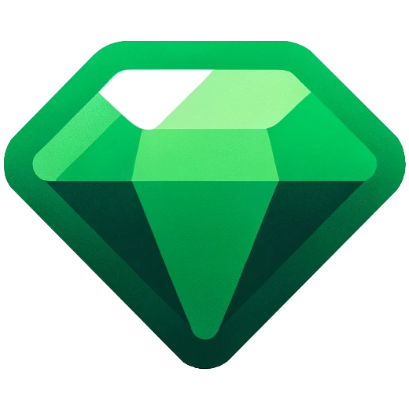

# <span style="color:#48bb78">Yaade</span> - Yet Another API Development Environment



Yaade is an open-source, self-hosted, collaborative API development environment.

## 🤔 Why did you develop Yaade?

When working with a team on an API I found that all teammembers have their own local collection of Postman requests that they use during development.
Everytime the API changes, all devs update their collection manually. Some don't get notified and wonder why their calls don't work anymore.
Therefore I was looking for a free and leightweight alternative to Postman where all the data would be stored on my own machine and could be securely accessed by my teammates.
There were a few promising candidates like Hoppscotch but non of them fullfiled all of my requirements, so I decided to build Yaade.

## 🌟 Features

1. Self-hosted: data never leaves your own server.
2. Secured: if you don't know the password, you can't get in
3. Persistent: even across container restarts
4. Easy single-file data import / export
5. Requests are executed on your machine so you can call localhost as well as remote servers
6. Most importantly: dark mode default

## ⚡ Install

To have the best experience with Yaade run the docker container on your sever and install the browser extension on your local machine.

### 1. 🐋 Docker

```bash
$ docker volume create yaade
$ docker run -d --restart=always -p 9339:9339 -e YAADE_ADMIN_USERNAME=admin -v yaade:/app/data --name yaade esperotech/yaade:latest
```

### 2. 🔧 Extension

Yaade uses a browser extension as a proxy to enable CORS requests. Simply install the extension, open it and input your server URL, eg. `https://yaade.example.com/`. From that point, all requests originating from your Yaade browser tabs will be proxied through the extension.

## 💾 Technology

1. SPA built with TypeScript, React and Vite.
2. Backend built with Kotlin.
3. H2 file-based database.
4. Browser extension with plain JavaScript.

## 🖥️ Local development

1. Install the required dependencies
    - Java 11
    - Kotlin
    - Node >= 16
2. Clone the repository
3. Install the project specific dependencies
```bash
$ cd scripts/
$ chmod +x install.sh
$ ./install.sh
```
4. Start the server on port 9339 using your IDE of choice (I use IntelliJ IDEA)
    - you can also run it by using the jar file directly `$ java -jar server/build/libs/yaade-server-1.0-SNAPSHOT`
    - note that you must set the environment variable `YAADE_ADMIN_USERNAME` to run
5. Start the vite dev server on port 9338
```bash
$ cd client/
$ npm run dev
```
6. Start the dev-proxy on port 9337
```bash
$ cd dev-proxy/
$ node index.js
```
7. Now open your browser and visit http://localhost:9337

## 🔨 Build

```bash
$ cd scripts/
$ chmod +x build.sh
$ ./build.sh
```

## 🤝  How can I contribute?

Your contribution is very welcome! First open an issue about the topic you want to contribute on, eg. adding a new feature, bugfixing or refactoring. We will then discuss further details. Eventually I will review your Pull Request and merge / release it.